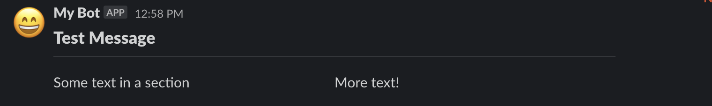

# Blocks Message with Header



Code:
```phpt
<?php

namespace App\Notifications;

use Illuminate\Bus\Queueable;
use Illuminate\Notifications\Notification;
use Nwilging\LaravelSlackBot\Support\LayoutBlocks\Blocks\SectionBlock;
use Nwilging\LaravelSlackBot\Support\LayoutBuilder\Builder;
use Nwilging\LaravelSlackBot\Support\SlackOptionsBuilder;

class TestNotification extends Notification
{
    use Queueable;

    /**
     * Get the notification's delivery channels.
     *
     * @param  mixed  $notifiable
     * @return array
     */
    public function via($notifiable)
    {
        return ['slack'];
    }

    public function toSlack(): array
    {
        $options = new SlackOptionsBuilder();
        $options->username('My Bot')
            ->iconEmoji(':smile:');

        $layoutBuilder = new Builder();

        $sectionBlock = new SectionBlock();
        $sectionBlock->withFields([
            $layoutBuilder->withPlainText('Some text in a section'),
            $layoutBuilder->withPlainText('More text!'),
        ]);

        $layoutBuilder
            ->header('Test Message')
            ->divider()
            ->addBlock($sectionBlock);

        return [
            'contentType' => 'blocks',
            'blocks' => $layoutBuilder->getBlocks(),
            'channelId' => 'general',
            'options' => $options->toArray(),
        ];
    }
}
```